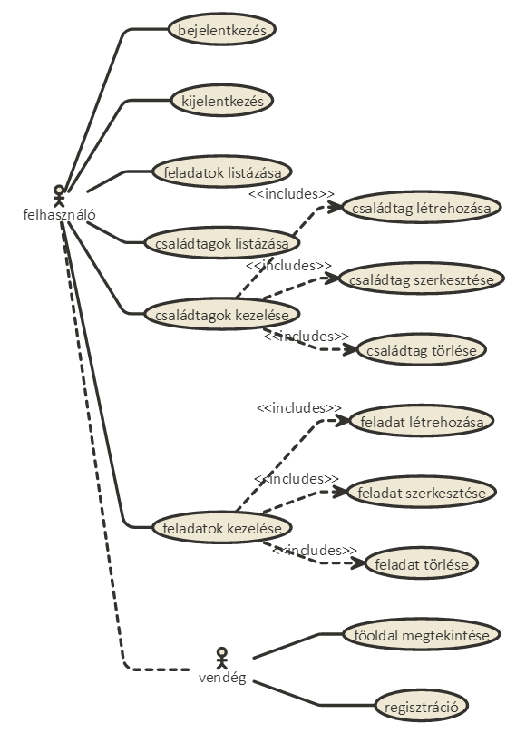
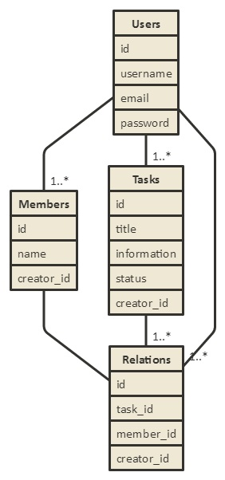

#Dokumentáció - FAMILY toDO

###<b>A programoról</b>
Beadandónak egy toDO CRUD alkalmazást valósítottam meg. Backendnek nodeJS-t használtam Adonis keretrendszerrel, frontenden idő hiánya miatt pedig jQuery-t használtam.

###<b>Funkcionális követelmények</b>
* Regisztráció
* Bejelentkezés
* Csak bejelentkezett felhasználók által elérhető funkciók
  - új családtag fevétele, szerkesztése, törlése
  - új feladat felvétele, szerkesztése, törlése

###<b>Nem funkcionális követelmények</b>
*	**Könnyű áttekinthetőség:** Színekkel jelölt, típus szerint csoportosítás
*	**Használhatóság:** Könnyű áttekinthetőség, felbontásfüggetlen folyékony megjelenés, ésszerű elrendezés, könnyű kezelhetőség
*	**Megbízhatóság:** Jelszóval védett funkciók, hibásan bevitt adatok esetén a program jól láthatóan jelezzen a felhasználónak
*	**Karbantarthatóság:** Könnyen lehessen bővíteni az alkalmazást, a különböző funkcionalitással rendelkező fájlok külön csoportosítása, ésszerű felépítés

###<b>Használatiesetek, funckionális követelmények</b>
**Vendég**: Csak a publikus oldalakat éri el.
* Főoldal
* Bejelentkezés
* Regisztráció

**Bejelentkezett felhasználó**: A bejelentkezés után egyéb funkciókat is elérhet.
* Új családtag felvétele
* Meglévő családtag szerkesztése
* Meglévő családtag törlése
* Létrehozott családtagok listázása
* Új recept felvétele
* Meglévő recept szerkesztése
* Meglévő recept törlése
* Létrehozott receptek listázása

###<b>Oldaltérkép</b>
* Publikus:
  * Főoldal
  * Bejelentkezés
  * Regisztráció

* Bejelentkezett:
  * Főoldal (a feladatok listája)
    * Feladat felvétele
    * Feladat szerkesztése
    * Feladat törlése
  * Családtagok (a családtagok listája)
    * Családtag felvétele
    * Családtag szerkesztése
    * Családtag törlése

###<b>Végpontok</b>
* GET/: Főoldal
* GET/register: Regisztrációs felület
* POST/register: Regisztráció adatainak elküldése
* GET/login: Bejelentkezési felület
* POST/login: Bejelentkező adatainak elküldése
* GET/logout: Kijelentkezés
* GET/create_task: Új feladat felvétele
* POST/create_task: Új feladat adatainak elküldése
* GET/edit_task/id: Már létező feladat szerkesztése
* POST/edit_task/id: Már létező feladat új adatainak elküldése
* GET/delete_task/id: Már létező feladat törlése
* GET/members: A családtagok kilistázása
* GET/create_member: Új családtag felvétele
* POST/create_member: Új családtag adatainak elküldése
* GET/edit_member/id: Már létező családtag szerkesztése
* POST/edit_member/id: Már létező családtag új adatainak elküldése
* GET/delete_member/id: Már létező családtag törlése

###<b>Adatmodellek</b>

###<b>Implementáció</b>
A feladat megvalósításához az AdonisJS keretrendszert használtam.

**Főbb fejlesztői fájlok MVC struktúrában**
* **view**
  * masterk.njk
  * home.njk
  * login.njk
  * register.njk
  * list_tasks.njk
  * create_task.njk
  * edit_task.njk
  * list_members.njk
  * create_member.njk
  * edit_member.njk
* **model**
  * User.js
  * Task.js
  * Member.js
  * Relation.js
* **controller**
  * AuthController.js
  * RegisterController.js
  * TaskController.js
  * MemberController.js

###<b>Kliens-oldali Javascript fejlesztések</b>
* **AJAX funkciók**
  * Regisztráció:
      * regisztráció elküldése
      * szerveroldalon való ellenőrzés
      * üzenet fogadása a szervertől és annak megjelenítése
  * Családtag szerkesztése:
    * szerkesztett adatok elküldése
    * szerveroldalon való ellenőrzés
    * üzenet fogadása a szervertől és annak megjelenítése
  * Családtag törlése:
    * törlési kérelem elküldése
    * szerveroldalon ellenőrzés és törlés
    * sikeres törlés esetén a családtag eltávolítása a táblázatból és a helyén a sikeres törlés üzenetének megjelenítése
  * Feladat szerkesztése:
    * szerkesztett adatok elküldése
    * szerveroldalon való ellenőrzés
    * üzenet fogadása a szervertől és annak megjelenítése
  * Feladat törlése:
    * törlési kérelem elküldése
    * szerveroldalon ellenőrzés és törlés
    * sikeres törlés esetén a Feladat eltávolítása a táblázatból és a helyén a sikeres törlés üzenetének megjelenítése

###<b>FELHASZNÁLÓI DOKUMENTÁCIÓ</b>
**Szükséges**
* operációs rendszer: tetszőleges
* hardver: operációs rendszer szerint megadva
* egyéb: böngésző használata (JavaScript ajánlott)

**Program használata**
* Böngészőben nyissuk meg a főoldalt
* Bal felső sarokban kattintsunk a Bejelentkezés feliratra
* Bejelentkezés/Regisztráció után a főoldalra jutunk
* Családtag létrehozásához kattintsunk a Családtagok menüpontra, majd a táblázat alatt az "Új feladat felvétele" gombra
* Töltsük ki az űrlapot
* "Hozzáadás" gombra kattintva mentsük el az adatokat
* Feladatok létrehozásához kattintsunk a Feladatok menüpontra, majd a táblázat alatt az "Új családtag felvétele" gombra
* Töltsük ki az űrlapot és rendeljünk a feladathoz családtagokat a kiválasztó gombokkal
* "Létrehozás" gombra kattintva mentsük el az adatokat
* A Feladatok menüpont alatt tudjuk kilistázni a rendszerbe bevitt feladatokat a hozzájuk tartozó adatokkal együtt